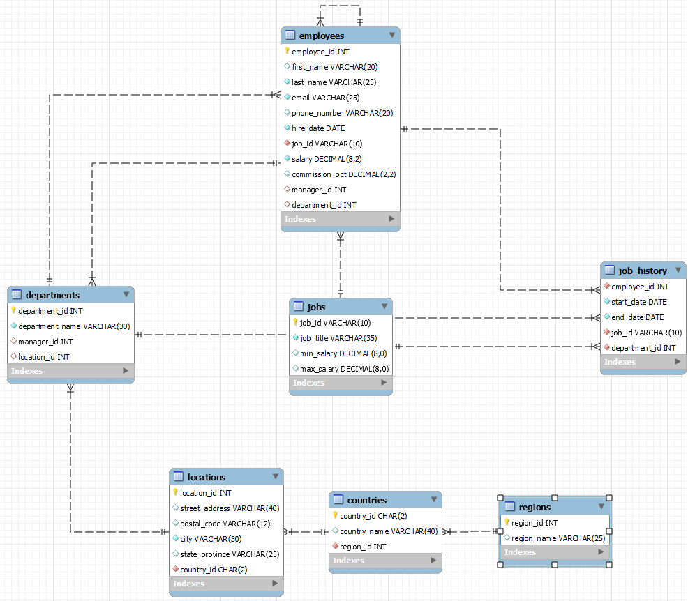

# ECO Parking system

#### 주차장 정보를 검색할 수 있으면 편할 것 같아 만든 사이드 프로젝트입니다.
가상의 임직원 관리 API 를 포함하였습니다.

---

## ERD

</img>

---

## 사용방법

1. 공공데이터 포탈에서 Open API service key 발급
   - 아래의 링크에서 Open API 에 대한 설명을 읽은 후 활용신청하여 service key 를 발급받습니다.
    https://www.data.go.kr/tcs/dss/selectApiDataDetailView.do?publicDataPk=15099883
  

2. src/main/resources/application.yml 설정
   - spring.datasource.url,
     spring.datasource.username,
     spring.datasource.password 을 자신의 개발 환경에 맞게 설정해줍니다.  
   - 또한 위에서 발급받은 service key 를 serviceKey 에 넣어줍니다.
  

3. API
   - 아래의 API 문서를 참고하여 API 를 테스트 할 수 있고, 기존 소스를 활용하여 API 를 수정할 수 있습니다. 
   - API 문서: 
   https://github.com/Sniij/eco/blob/master/src/main/resources/static/docs/index.html
   - API 는 간단한 User 관리와 부서 관리를 포함하여 주차장 검색 API 를 포함하고 있습니다.
     - Employee GET( information, job history )
     - Employee PATCH( information, salary )
     - Department GET( information, location )
     - RestPark GET( information, 추석 명절 개방여부 )
  

4. 참고
    - Spring Cloud 기본 설정을 완료했기 때문에 AWS service 를 credential 증명 후 사용 가능합니다. 예를 들어 서버 리소스를 parameter store 에서 불러와 사용할 수 있습니다.
    - User 와 관련된 더미데이터는 Oracle 의 HR 스키마의 더미데이터를 사용하였습니다.
